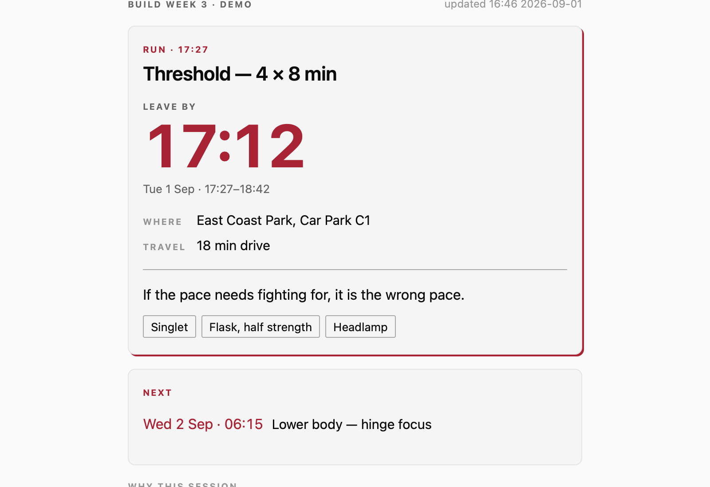

# today.calvin.sg

[](https://today.calvin.sg)
[](https://github.com/calvindotsg/today-mini-app/actions/workflows/ci.yml)
[](https://github.com/calvindotsg/today-mini-app/commits/main/)
[](./LICENSE)

Hi, I am Calvin. I run and ride before sunrise, and a training assistant writes my week as a
Claude artifact. This is the one screen that answers the only question I have at 6am, from inside
my chat with [@calvindotsg_bot](https://t.me/calvindotsg_bot): **what's on today, and what time do
I leave.**

<picture>
  <source media="(prefers-color-scheme: dark)" srcset="docs/preview-dark.png">
  
</picture>

Not a dashboard. Strava and Garmin Connect already cover history, splits and volume. What no other
app can show me is *the plan* — where to be, and **what time to leave**, which is the number that
changes what I actually do.

## Overview

Two screens. **Today** opens first and answers the 6am question; **The week** is one tap away and
carries the rest of the plan, so I no longer open the artifact to see what Thursday looks like.

| | What it shows |
| --- | --- |
| **Now** | The session I am in, or the next one I have to leave for. `Leave by` where the plan states one, the start time where it does not, and `Until` while a session is under way. Place, travel time, the one rule for the session, and what to bring |
| **Next** | The one after it, so I can see whether tonight commits me to a 6am tomorrow |
| **Neither** | An honest line. A rest day says so; a plan that does not cover today says *that*, separately from a plan that is merely old |
| **The week** | All seven days: the volume against its ceiling, each day's character and bedtime, and every session with its times, place, figures, the rule decided before the start, and why it exists. Days already spent collapse to one line — what a finished day settled is what the weekly artifact is for |

Getting back is Telegram's own back arrow, **and** a `Today` control the page draws itself, at the
top of the week and again at the foot. That redundancy is deliberate and was learned the hard way:
the in-page control used to be drawn only where the client could not draw an arrow, and on the one
device that mattered the arrow rendered and did nothing, leaving the week with no exit. A way back
does not get to depend on a bridge.

The session in front of me **stays** in front of me while it is under way — until the plan's own
`until`, or a bounded grace where it states none, and never past the moment the next session claims
me.

Three theme states, applied before first paint: system, light, dark. The page also tells Telegram
what colour it is painted, so the chrome above it matches instead of seaming.

## Background

The training assistant this belongs to runs on a box whose firewall carries **zero inbound rules** —
nothing reaches it — and whose egress goes through a short allowlist. Serving this app from there
would be the first open door on a machine that has none.

So it is served from the edge instead, and it holds **one week of a training plan and nothing
else**:

```
  a Claude session ──► scripts/publish.mjs ──► Cloudflare KV ──► Worker ──► Telegram
   (reads the weekly                                             │
    training artifact)                                           └── validates initData,
                                                                     refuses anyone but me
```

If this Worker were fully compromised, an attacker gets my session times. Not the server, not a
credential for it, not the agent. **That containment is the design, not a side effect** — and both
`wrangler.jsonc` and `src/worker.js` say so at the exact point where widening it would be tempting.

## How a stranger is kept out

Telegram signs every launch. The Worker checks that signature and then checks who it is for:

1. HMAC-SHA256 over the launch parameters, keyed by `HMAC(bot_token, "WebAppData")`, compared in
   **constant time** (`src/initdata.js`).
2. `auth_date` no more than **15 minutes** old, so a captured launch cannot be replayed later.
   Future-dated launches are refused too.
3. `user.id` equal to the configured id — **the actual access control.** Steps 1 and 2 prove the
   launch is real; only this decides whose it was.

Step 3 is the one worth stating plainly, because it is counter-intuitive: **a stranger's `initData`
is cryptographically valid.** Telegram signs every launch with the same bot token, so a suite that
only tests the signature passes completely while the app admits everyone. The test that matters is
*a correctly-signed launch belonging to somebody else*, and it is the one most likely to be skipped.

A failure at any step is `401` with a **zero-byte body** and no content type.
`test/worker.http.test.mjs` asserts the body length on every rejection, because a 401 that still
ships the page is a real bug and an easy one to write.

### Why an unauthenticated visitor still gets a page

Telegram puts the launch parameters in the URL **fragment**, which is never sent to a server. No
server can validate a Mini App launch on the first `GET` — so some document is always served before
anyone is proven.

This used to be a contentless shell that replaced itself with the real page. That design is wrong
behind a nonce-based CSP and fails silently: `document.write` does not create a new document, so
the written markup is judged against the *first* response's policy, the second nonce matches
nothing, every inline style and script is dropped, and the result is a blank page on an unstyled
background — with two successful 200s in the log.

So: **one document, one nonce.** `GET /` carries the design and the renderer and **no training
data**. `POST /s` returns the week as JSON to a validated launch and 401-empty to everyone else.
The defensible property is *no user data without auth*, and a test asserts it against distinctive
values seeded into the store rather than against a guess at what the real content looks like.

## Tech stack

A [Cloudflare Worker](https://developers.cloudflare.com/workers/) with a
[Workers KV](https://developers.cloudflare.com/kv/) namespace, five source files, and **zero
dependencies** — no framework, no bundler, no lockfile. Even `telegram-web-app.js` is avoided: what
it is needed for is three `postEvent` calls over the documented bridge plus a listener for the back
button coming the other way, and if the bridge is missing the page still renders — it just draws
its own way back instead.

`node --test` is the change gate. The hostname resolves through a proxied `AAAA` record in
[`calvindotsg/portfolio-v2`](https://github.com/calvindotsg/portfolio-v2)'s octoDNS zone, added by
pull request; this Worker attaches with a **route**, not a custom domain, so it never writes DNS —
see the comment in `wrangler.jsonc` for what breaks if that is "simplified".

## Getting started

```sh
git clone https://github.com/calvindotsg/today-mini-app
cd today-mini-app
cp .dev.vars.example .dev.vars   # ← first, or the auth suite fails in a confusing way
npm test
```

There is nothing to install. `.dev.vars.example` holds a **fake** bot token, and the suite mints its
own `initData` against it, so every auth path is exercised without a real credential. See
[CONTRIBUTING.md](./CONTRIBUTING.md) for why that copy is load-bearing.

| Command | What it does |
| --- | --- |
| `npm test` | The whole suite, 67 tests |
| `npm run test:auth` | Just the HTTP auth suite, against the real Worker in the real runtime |
| `npm run dev` | `wrangler dev` on an emulated KV |
| `npm run deploy` | Ships to `today.calvin.sg` — CI also does this on merge |
| `npm run publish:week` | Reduces a weekly artifact and writes it to KV |

First-time setup of a fresh deployment:

```sh
npx wrangler kv namespace create WEEK        # once; put the id in wrangler.jsonc
npx wrangler secret put BOT_TOKEN            # the bot's token
npx wrangler secret put ALLOWED_USER_ID      # the one Telegram user id allowed in
npx wrangler deploy
```

## Configuration

| Where | What lives there |
| --- | --- |
| Worker **secrets** | `BOT_TOKEN`, `ALLOWED_USER_ID`. Never `vars` — one is the bot's whole identity, and the other is a personal identifier this repository has no reason to carry |
| `wrangler.jsonc` | The route, the KV binding, the compatibility date. No secrets, no observability — the only interesting request carries a launch credential, and the cheapest way to never log it is to log nothing |
| GitHub environment `production` | `CLOUDFLARE_API_TOKEN` for the deploy, behind a branch policy limited to `main` |
| GitHub variable | `CLOUDFLARE_ACCOUNT_ID` — a variable rather than a secret, because masking a value that appears in wrangler's own error output redacts unrelated log lines |

The Worker **fails closed** without its secrets. `test/worker.http.test.mjs` proves a valid launch
is still refused when `ALLOWED_USER_ID` is unset, which is the mistake that would otherwise make
the app public on the day someone forgets a `wrangler secret put`.

## Publishing a week

```sh
node scripts/publish.mjs ~/path/to/week.html --put
```

**A cron cannot do this.** The week lives in a private Claude artifact readable only by a Claude
session — the box has no route to `claude.ai`, and a script on my Mac has no credential for it. So
publishing is on demand, when the week's plan is written or revised.

Which is exactly why the app treats freshness as something to **state** rather than assume. It
shows two different kinds of out-of-date, separately, because conflating them hides the worse one:

- **stale** — the push is more than 18 hours old.
- **not this week** — the plan's own `weekStart`/`weekEnd` do not contain today. A plan pushed an
  hour ago for last week is *fresh and useless*, and only the second banner says so.

The publisher pushes the **whole week**, reduced to twelve fields per session — 12.4 KB for a real
week, 3.9 KB brotli on the wire — and refuses above a 24 KB ceiling. The Worker slices to
today-and-the-next-two per request, because a slice baked in at publish time is correct on the day
it is pushed and useless by Wednesday.

### And then it says so in Telegram

A published week nobody is told about is a week found by opening the app on the off chance. So a
successful `--put` also sends one message, with two buttons that open this app on the screen named:

| | |
|---|---|
| **Today** | `t.me/calvindotsg_bot/training?startapp=today` |
| **The week** | `t.me/calvindotsg_bot/training?startapp=week` |

Telegram delivers `startapp` to the page as `tgWebAppStartParam`, in the same URL fragment as the
launch credential — so the screen is chosen **before the first paint**, with no extra round trip.
`screenFor()` maps it through a **closed set**: `week` opens the week, and everything else —
an old link, a typo, a probe — opens today. It is read from an unsigned part of the URL and is
never treated as a credential; both screens render the same already-authorised week.

🔴 **The message is sent by the Hermes box, not by this repo, and not over HTTP.** That box has a
Hetzner firewall with **zero rules**, and its gateway container sits on an `internal: true` Docker
bridge with **no published port**; the tunnel carries exactly two ingress rules, the dashboard and
ssh. A public webhook endpoint would have meant a new hostname — and therefore a DNS record, which
on `calvin.sg` must go through octoDNS in `portfolio-v2` or break its weekly drift gate — plus a
new Access application, all to serve one caller that already had an Access-gated route in. So
`publish.mjs` pipes a small envelope over that existing `ssh ssh-hermes` route into
`~/bin/hermes-week-notify`, which signs and sends on the far side. **No Hermes credential exists on
this side at all**, and nothing new is exposed to the internet.

The envelope is a summary, not the week: the label, the dates, the counts, and the one session that
is next. It has to be, because the box **cannot read `today.calvin.sg`** — `calvin.sg` is
deliberately absent from its egress allowlist, so nothing over there can fetch what it was not sent.

⚠️ **A notification failure is exit 3, not exit 1, and the difference is the point.** By then the
week *is* at the edge and the app *is* serving it; reporting that as a failed publish invites a
republish of something that published fine. The two halves are separated too, because `sendMessage`
has no idempotency and a blind re-run posts a second message — so the box exits 3 when nothing was
sent (safe to re-run) and 4 when the message went and only the agent wake did not (do not re-run).
`--no-notify` skips the whole thing.

**Nothing is sent without `--put`.** The dry run the weekly skill uses as its gate stays silent.

### The archive, because `dist/` is not a backup

A successful `--put` also writes the published payload to
`~/.local/state/today-mini-app/published/`, newest twelve kept.

🔴 **This exists because `dist/payload.json` was the only copy of a real week and a test run erased
it.** On 2026-09-02 a mutation pass published a fixture over the live week; recovery came from
`dist/payload.json` — and the next `npm test` overwrote it, because the publisher rewrites that file
on **every** run, `--put` or not. The archive is written only on a real publish, only after the KV
write succeeds, and lives outside the repository so `rm -rf dist`, a fresh clone and the suite
cannot touch it. `TODAY_ARCHIVE_DIR` overrides the path; the tests set it file-wide and assert they
did.

## Testing

```sh
npm test          # 91 tests
```

- `test/initdata.test.mjs` — the signature algorithm, against `initData` minted the way **Telegram**
  mints it rather than by the checker's own code. That is not a stylistic choice: an earlier version
  folded `signature` into the data-check string, which broke every launch from a real client while
  every hand-minted fixture still passed.
- `test/view.test.mjs` — negative controls, which are most of the file. The original five: every
  optional field absent, a day with nothing actionable left, data past the staleness threshold, an
  empty `days` array, and a session's hold on the screen running past the next thing I have to
  leave for. The week screen added more, and two are worth naming — **the past/today/ahead boundary
  at 00:05 Singapore time**, which a UTC comparison gets wrong every morning for eight hours, and
  **an unknown key inside `bed`**, which the allowlist has to drop even though `pick` does not
  recurse. Each was checked by breaking the code it guards and watching it fail.
- `test/publish.test.mjs` — the publisher's two content gates, by running the publisher.
- `test/notify.test.mjs` — the envelope, and the wiring that sends it. The wiring half runs the
  real `--put` path with **`npx` and `ssh` shimmed onto `PATH`**, so the publisher genuinely
  spawns something, pipes the envelope into it and reads its exit code — only the far end is
  fake, and nothing touches KV or the box. A source grep was the alternative and it passes on
  code that is never reached.
- `test/deeplink.test.mjs` — `?startapp=`, against the **shipped source**. `screenFor()` and
  `launchParams()` have to live inline in `src/app.html` (the page is one document, deliberately),
  so these tests cut the real functions out of the file and run them. A copy in a module would
  have been the easy path and is the one `view.test.mjs` already warns about.
- `test/worker.http.test.mjs` — the real Worker in the real runtime, over HTTP.

One control was deliberately **not** written: *"every status prints its own word."* Nothing in the
suite renders the DOM, so at view level it could only assert `status` passed through unchanged —
and would have passed even if the week screen printed no status word at all. The mapping moved into
`src/view.js` instead, where a test can actually fail.

CI runs the suite on Node 22, 24 and 26, then deploys `main` and asserts the edge is serving that
exact commit. ⚠️ **The `production` environment requires a review**, so a merge does not ship on its
own — it waits for an approval, and until that click `main` is merged and the edge is still serving
the previous commit. `.github/workflows/drift.yml` catches that: it re-checks on **every push to
`main`** and weekly, opening an issue when the edge and the tree disagree and closing it when they
agree again. It exists because `scripts/publish.mjs` writes KV directly, so the page and the data
ship on two independent tracks and either can be stale while the other is current.

## Files

| | |
|---|---|
| `src/worker.js` | Routes, auth, security headers. The whole server |
| `src/initdata.js` | Telegram signature validation. Deliberately small so it can be re-read against the docs in a minute |
| `src/reduce.js` | week-state → the published payload. Two allowlists |
| `src/view.js` | payload + a clock → what the one screen shows. Pure; no DOM |
| `src/notify.js` | the reduced week → the summary envelope the Hermes box is sent. A named subset, never a spread |
| `src/app.html` | The one screen, in the calvin.sg design system |
| `scripts/publish.mjs` | The publisher |
| `CONTRACT.md` | The `week-state` shape, **measured** across two artifacts. Read this before changing `reduce.js` |
| `CLAUDE.md` | Reference for agents working in this repository |

## If this is ever retired

**Delete the KV data** rather than leaving it. It is a copy of personal training data at the edge,
and a store nobody reads is still a store somebody could.

```sh
npx wrangler kv key delete week:current --binding WEEK --remote
```

## License

[MIT](./LICENSE).
